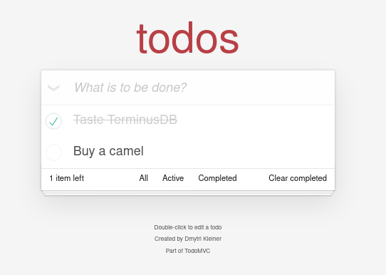

# TerminusDB TodoMVC \(feat. Svelte\)

```text
 _____                   _                 ____  ____   _____         _       
|_ _ _|__ _ __ _ __ ___ (_)_ __  _   _ ___|  _ \| __ ) |_ _ _|__   __| | ___  
  | |/ _ \ '__| '_ ` _ \| | '_ \| | | / __| | | |  _ \   | |/ _ \ / _` |/ _ \ 
  | |  __/ |  | | | | | | | | | | |_| \__ \ |_| | |_) |  | | (_) | (_| | (_) |
  |_|\___|_|  |_| |_| |_|_|_| |_|\__,_|___/____/|____/   |_|\___/ \__,_|\___/
```

## What is this?

This is a simple example of making a typical web app with TerminusDB. This example implements [TodoMVC](http://todomvc.com) with [Svelte](https://svelte.dev), and then uses TerminusDB to store the Todo list.

Please [install TerminusDB](https://terminusdb.com/hub/download) and have it running. TerminusDB just needs to be running, you will not be using the console right now, so you can just minimize it.

Once TerminusDB is running, add the DB and Schema.

```bash
$ npm run initdb

> svelte-app@1.0.0 initdb /home/dk/Work/TerminusDB/terminusdb-todoapp
> node util/initdb.js

# checking db
# creating db
# checking schema
# creating schema
# add todo1
# add todo2
# done
```

Now npm install and run the app.

```bash
$ npm install && npm run dev

[...miles of scrolling console spew...]

 Your application is ready~! 🚀

  - Local:      http://localhost:5000
  - Network:    Add `--host` to expose

────────────────── LOGS ──────────────────
```

You can access the Todo app on [http://127.0.0.1:5000](http://127.0.0.1:5000) and, you know, do stuff.



## Ok, so how does that all work?

We'll spare you the details of npm and Svelte. Please see the excellent documentation from those projects to learn more. We will focus on the TerminusDB stuff here.

Using Svelte we created a JavaScript Single Page Application \(SPA\) that implements the specifications of TodoMVC, a project used to compare frontend frameworks.

The SPA runs in the browser and uses TerminusDB as the backend, as TerminusDB is a database for the web, no intermediary backend server is needed.The frontend can connect directly with the database using RESTful HTTP and the [TerminusDB JavaScript SDK](https://www.npmjs.com/package/@terminusdb/terminusdb-client)

### So, how does that initdb bit do its thing?

We will only give a few important examples from the initdb script here, you can see the entire script with comments here: [util/initdb.js](https://github.com/dmytri/terminusdb-todoapp/tree/9809d2f4d7d28762d9d46175bc38a54db0c8dd11/util/initdb.js)

First we use the JavaScript SDK to connect to the Database.

```javascript
const Client = require('@terminusdb/terminusdb-client')
const DB = new Client.WOQLClient('https://127.0.0.1:6363/',
  { user: 'admin', key: 'root' })
DB.organization('admin')
DB.connect()
  .then(() => hasDB())
  .catch(error => console.log('error', error))
```

Once it's connected, we call a function called `hasDB` which creates a database called `TodoMVC`.

```javascript
DB.createDatabase('TodoMVC', {
  label: 'TodoMVC',
  comment: 'DB for TodoMVC backend',
  schema: true
}, 'admin')
  .then(() => hasSchema())
```

When the database has been created the function `hasSchema` is called.

In order to make our code a little more concise, we can set our DB to `TodoMVC` and create a constant `Q` for `Client.WOQL`, which will help us build queries.

```javascript
DB.db('TodoMVC')
const Q = Client.WOQL
```

Now we can use our connected `DB` and our query builder `Q` to create a schema for the database.

```javascript
DB.query(Q
  .doctype('Todo')
  .label('Todo')
  .description('Things To Do')
  .property('title', 'xsd:string').cardinality(1)
  .property('completed', 'xsd:boolean').cardinality(1)
).then(response => addExamples())
```

Here we created our schema, which is a `Todo` document type that has two properties, a `string title` and a `boolean completed`. Both have a `cardinality` of `1`, which means that each `Todo` can only have 1 of each property, for example a single `Todo` can not have two titles or zero titles, but must have one.

Once the `Todo` document type is created, the function `addExamples` is called.

### Triples, Triples, rah rah rah, Triples, Triples, ha ha ha.

```javascript
DB.query(Q
  .add_triple('doc:todo1', 'type', 'scm:Todo')
  .add_triple('doc:todo1', 'title',
    Q.literal('Taste TerminusDB', 'string'))
  .add_triple('doc:todo1', 'completed',
    Q.literal(true, 'boolean'))
```

So above is how we add an example Todo to the database, by adding triples.

Now, what in tarnation is a triple? Well, in TerminusDB _everything_. It's all triples. Triples all the way down.

Formally, a triple is a _fact_ that includes a _subject_, a _predicate_, and an _object_.

The _subject_ tells us what _thing_ this _fact_ refers to , in our case that _thing_ is a document in our database called `doc:todo1`.

The _predicate_ tells us what _this fact_ tells you about the _thing_ you are referring to. So in our case, we have three predicates:`type` tells us what kind of document `doc:todo1` is, `title` tells us what the title is, and a `completed` value that tells us if it has been completed or not.

The _object_ is the _value_ of the predicate for this subject.

So the object `'scm:Todo'` is a Todo document type, The object `'Taste TerminusDB'` is a string that containing the title, and the object false is a boolean that means that it is not completed.

This language is handed down to us by the venerable creators of RDF and OWL, standards that TerminusDB uses internally, but those of us who don't care about these things can think of a triple in a simpler way.

Think of a triple as an object, a property, and a value. So, each triple assigns a value to a particular property of an object, with the value also being an object. So subject just means this object, predicate is a property name, and object is the value of this property on the subect.

Looking at the query above, we add three triples, one that assigns a type to our Todo, another that assigns a title, and another that assigns the completed value.

So for us to tell the DB to _add a Todo with the title "Taste TerminusDB" that is not completed_, we add the three triples above.

The `Q.literal` bits are how we cast values. Properties in TerminusDB have many more possible types of values than JavaScript has.

Thinking in terms of triples is one of the two major differences in how Terminators think compared to users of relational or document based databases. The other is unification. That's a real head trip, and we'll cover that in the next section.

### Ok, we created the DB and an example Todo, but how does the app work?

Once again, we will just cover some important examples, you can find the complete script here [src/terminusdb.js](https://github.com/dmytri/terminusdb-todoapp/tree/9809d2f4d7d28762d9d46175bc38a54db0c8dd11/src/terminusdb.js)

Also, the JavaScript SDK has convenience functions that allow you to interact with documents and their properties in a simpler way, often like other graph or document databases, we will not use these. We're not trying to be mean or anything, we just really want you to understand this triple business, oh, and unification, more on that in a bit.

In the terminusdb.js module we export 6 functions, `state`, `create`, `alter`, `remove`, `toggle` and `clear`. These functions are used by the Svelte app to read from and write to the database.

I'll explain `state` and `toggle`

The `state` function returns all the `Todo` documents in the database, it works like this.

```javascript
DB.query(Q 
  .triple('v:Doc', 'type', 'scm:Todo')
  .triple('v:Doc', 'scm:title', 'v:Title')
  .triple('v:Doc', 'scm:completed', 'v:Completed')
).then((response) => {
  callback(null,
    response.bindings.map(item => ({
      id: item.Doc,
      title: item.Title['@value'],
      completed: item.Completed === 'system:unknown'
        ? false
        : item.Completed['@value'] === 'true'
    }))
  )
})
```

Oh, we love triples.

So, we've covered add\_triple above when we created our database and added an example `Todo`, we now we are querying for existing triples, and we are doing so using, you guessed it, unification.

The _subject_ in our triple statements above is always `v:Doc`. This is a variable.

In our first triple statement we are saying we don't know what this value is. So, the database will solve for all possible values of this subject that match the _predicate_ and _object_.

The predicate is `type` and the _object_ is `scm:Todo`. So the first triple statement will solve for all triples in the database that have the `type` `scm:Todo.` Simply, this means that it returns all the `Todos` in the database.

Our SDK uses a _fluent_ style, so the query continues with the next triple statement, which says that for each possible value of `v:Doc` from the previous statement, find a triple that has the same _subject_ and a _predicate_ of `scm:title` \(think property called title\) and assign the object \(think the value of the property\) to the variable `v:Title`.

The next triple statement does the same thing but for the _predicate_ `scm:completed`.

So, all told, this is a way of saying find all of our `Todos` and get the title and completed properties for them too.

We then take look at all the results and map them to an array of javascript objects with id, title and completed as properties. The Todo app uses this array for it's state.

Unification happened here, but it's subtle, so let's not let it slip by without comment. Understanding what happened unlocks the power of logic!

Most of us developers think in terms of inputs and outputs. Functions have arguments, which are inputs, and return something, which is an output.

Triple statements are not functions, and the three values are not arguments. You construct a query by chaining statements, you tell the database what you know, and it returns all possible solutions based on what you know and what is found in the database.

Ok, so before you think I'm wasting your time with profound sounding bullshit, let me give you some more examples that are not used in this app.

Say we know the document Id of a Todo, say `doc:todo1`, but want to know it's title, this means we know the _subject_, `doc:todo1` and the _predicate_ `scm:title`, but not the _object_, the string which contains the title

So we say this:

```javascript
triple('doc:todo1', 'scm:title', 'v:Doc')
```

The solution to this statement will bind the string which contains the title to the variable `v:Doc`

So, the first two "arguments" \(they're not arguments\), are kinda _like_ arguments, and the third "argument" is kinda _like_ a return value \(it's not a return value\).

Now, say we know we have a `Todo` with the title "Taste TerminusDB", but we don't know the document Id.

Now we say this:

```javascript
triple('v:Doc', 'scm:title', 'Taste TerminusDB')
```

Now the databases solves this statement such that the variable `v:Doc` contains the document Id of the Todo with the title 'Taste TerminusDB'

Woah, right?

You might want to jump into the [TerminusDB console ](https://127.0.0.1:6363)and try these two queries. If you haven't yet deleted the `Todo` with the document Id `doc:todo1` and the `title` "Taste TerminusDB" the queries will work if you just copy and paste them in.

It feels like the inputs and outputs just move around. But it's more complicated than that. These are not inputs and outputs, they are statements and solutions.

You say what _you know_ and the database finds _all possible solutions_ where your statement is true.

A few of you are saying, oh, like in [Prolog](https://en.wikipedia.org/wiki/Unification_%28computer_science%29). Well, yeah, like in Prolog, but let's explain some more.

So a TermunisDB query chains many statements, and the database finds all solutions where all the statements are true, and as variables are solved for, those variables are bound and available to the next statements.

Stay with me here, this is where it really gets trippy.

Let's take a look at another function from `terminusdb.js`, the `toggle` function. This function is given a boolean value passed as `data.completed` and sets all `completed` on all `Todos` to this value.

This is the query that is used:

```javascript
DB.query(Q
  .triple('v:Doc', 'completed', Q.literal(!data.completed, 'boolean'))
  .delete_triple('v:Doc', 'completed', Q.literal(!data.completed, 'boolean'))
  .add_triple('v:Doc', 'completed', Q.literal(data.completed, 'boolean'))
)
```

So, let's say that the `toggle` function was called with data.completed having a value of `true`.

The first triple statement solves for all subjects \(all `Todos` in our case\) in to database with a predicate `completed` with an object \(think value\) that is `false` \(`!data.completed`\), and then binds the document d of each of these to the variable `v:Doc`.

We now have a list of all Todos that are not completed so we can set them to be comepleted.

The next statement, delete\_triple, receives all the document Ids from first statement and deletes each of them. Remember that one triple is a property here, so it's not deleting the `Todo`, just it's `completed` property. Also note that because our Schema has a cardinality of 1 for  `completed`, if we our query only had these two statements it would fail, because a `Todo` can not have zero titles, but since we add `completed` with the value `true`\(`data.completed`\)in the third statement, an `add_triple`, the query is successful.

This is a demonstration of unification. The value of 'v:Doc' is solved for all subjects where completed is false, this value is available for all subsequent statements. Queries far more powerful than what we need for a Todo app are possible, but let's leave that for another time.

Another interesting thing about TerminusDB is that we can not change a triple, and even the delete just makes it invisible in the current revision. It's an append-only database, this is what makes revision control and time-travel through the data history possible. There is in fact an `update_triple` convenience function in the SDK that you can use to make your code more concise, but it's just doing more or less the above under the hood.

Meditate on triples and unification. It is the path to Terminatordom.

You are now ready to dive into the source code and play in the TerminusDB console. Feel free to come to our [Discord server](https://discord.gg/Gvdqw97) we'd love to help you and get your feedback.

## So, I guess this is just hypothetical, you wouldn't really build a Todo app with TerminusDB?

Well, not so fast. Certainly you don't need TerminusDB to make a TodoMVC example, just dumping objects into the browser's local storage would do just fine. And it's true that most users of TerminusDB today are using it in DataOps/MLops scenarios, where data scientists and analysts are involved. It's roots are very much in being a database for data people.

However, if you wanted to really disrupt the Todo industry with a breakthrough app, then yeah, you would want to use TermninusDB for your Todo app.

For one, it's schema control keeps your data in good shape, it's RESTful HTTP API makes it easy to use from any stack, even a frontend web stack.

However, what will really accelerate your development are it's collaboration features. The ability to clone, fork, branch and merge data, and the fact that your have revision control means that so much hard stuff becomes easy.

Take for example, adding an undo feature. With a normal database you need to build your own versioning into your data model, turning rows into journals. With TerminusDB you have versioning out of the box, you can just revert a commit and viola, you have undo, and redo, and you even have proof for your compliance officer that the data changed in a specific order, and when and by whome all changes where made.

Now imagine you want to add workflow to your Todo app. Like a Todo gets assigned by a manager, done by an assignee and confirmed complete by a different manager.

Once again, with another database this workflow would need to be added to your data model, you would need to add fields and classes or tables to contain what workflow stage each todo was in, and if the workflow changed, as it always does in the real world, sometimes from task task, your data model would also need to change, this becomes brittle fast.

With TerminusDB you could model your workflow with branches, where assignments could be added to a managers branch, merged into an assignees branch, then merged into a approvers branch, etc. Branches could be made for ad-hoc situations that required a different workflow, and none the less all Todos could eventually be merged into a common "done" branch, all with no workflow in the data model itself.

Say you had some clever data scientists that wanted to do some predictive analytics on your todos, you would need to give them access to your production database and risk them degrading the performance of your site with their queries, or even bringing it down with some late night fat fingering. With TerminusDB and TerminusHub they could just clone or fork their own copy of the data, merge in new updates whenever they like, and even push back changes if they somehow enrich the data.

And last but not least, there are the issues covered in [Continuous Everything as Code](https://terminusdb.com/blog/2020/05/29/continuous-everything-as-code/), your devs may be changing your schema, and sometimes your data with each revision of the software that powers your app, and these changes need to go down your integration and deployment pipeline, yet other databases don't work well with ci/cd. TerminusDB and TerminusHub make it much easier to clone, fork, and merge databases to create development, staging and production environments and push changes between them.

Surely, whether you are building an ML/AI Skynet, or a humble productivity app, content site or e-shop, all these benefits are worth the effort to learn to think in triples.

